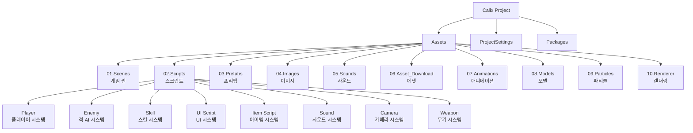
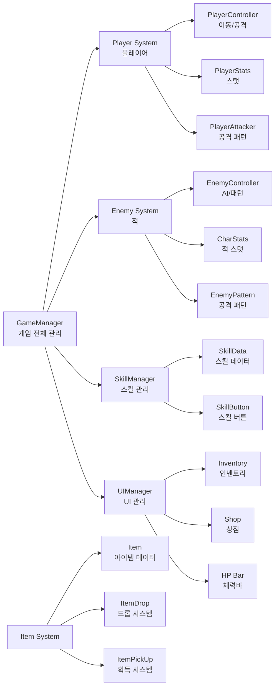
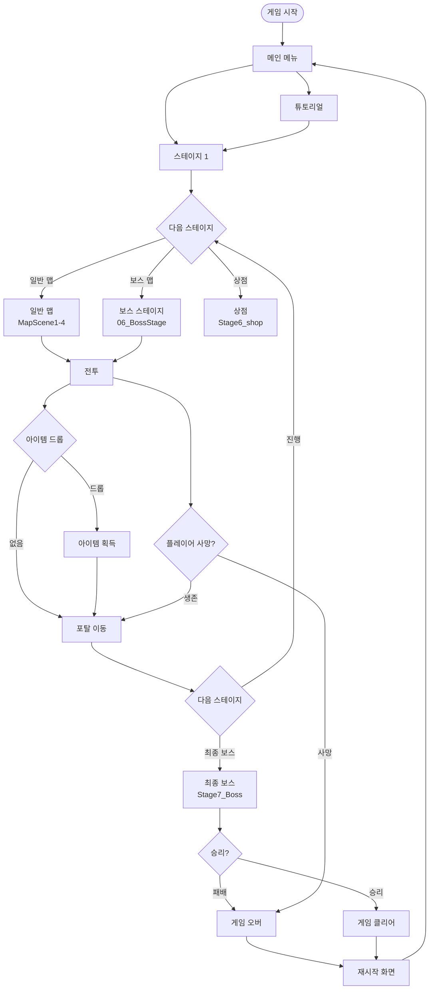
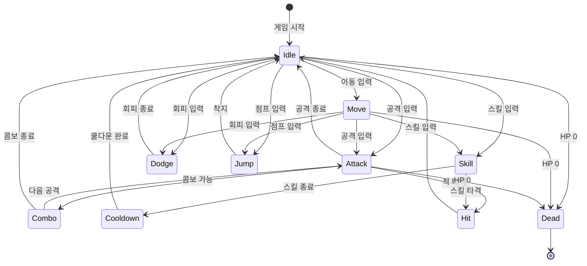
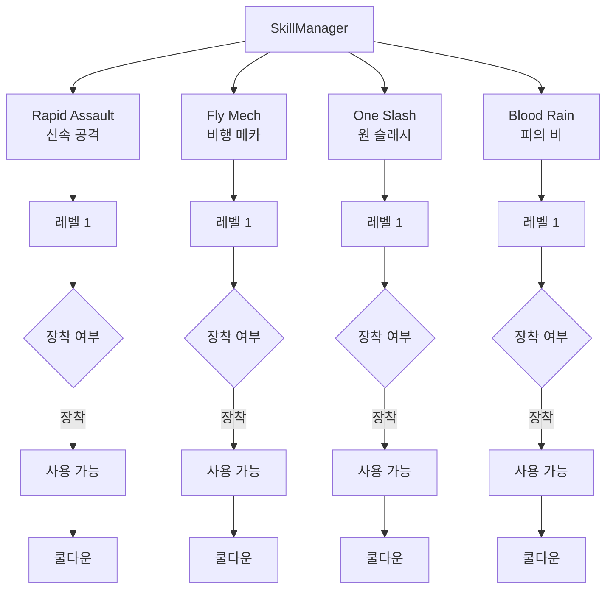
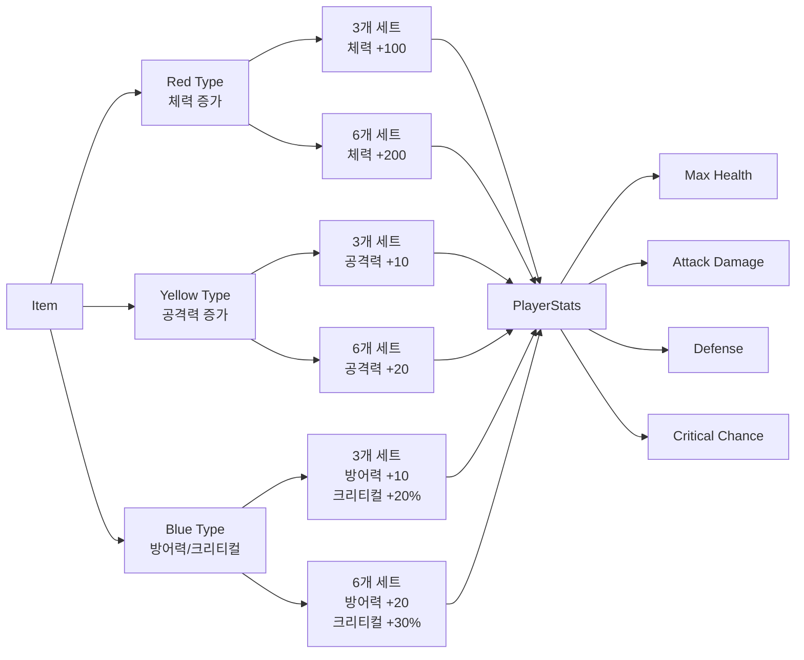
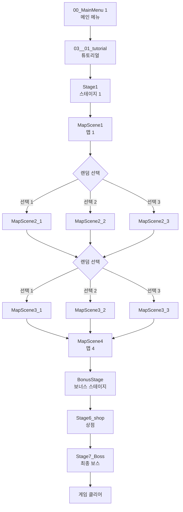

# 🎮 Calix Project

대학교 졸업작품 Unity 게임 프로젝트

## 📋 프로젝트 개요

Calix는 Unity 엔진을 기반으로 개발된 액션 RPG 게임입니다. 플레이어는 다양한 스킬과 무기를 활용하여 적을 처치하고, 아이템을 수집하며 스테이지를 진행합니다.

## 🏗️ 프로젝트 구조



## 🎯 게임 시스템 아키텍처



## 🎮 게임 플로우



## 👤 플레이어 시스템



## ⚔️ 스킬 시스템



## 🎒 아이템 시스템



## 🗺️ 스테이지 구조



## 🛠️ 주요 기능

### 게임 관리
- **GameManager**: 게임 상태 관리, 씬 전환, 나노 카운트 관리
- **EventSystem**: 게임 이벤트 시스템 관리

### 플레이어 시스템
- 이동, 점프, 대시, 회피
- 근접 공격 및 콤보 시스템
- 무기 교체 시스템
- 스탯 관리 (체력, 공격력, 방어력, 크리티컬)

### 적 AI 시스템
- NavMesh 기반 패트롤 및 추적
- 공격 패턴 시스템
- 적 타입별 행동 패턴

### 스킬 시스템
- 4가지 스킬 (Rapid Assault, Fly Mech, One Slash, Blood Rain)
- 스킬 레벨 및 장착 시스템
- 쿨다운 관리

### 아이템 시스템
- 3가지 타입 (Red, Yellow, Blue)
- 세트 효과 시스템 (3개, 6개)
- 아이템 드롭 및 획득

### UI 시스템
- 인벤토리
- 스킬 선택 및 쿨다운 표시
- HP/나노 카운트 표시
- 상점 UI
- 게임 오버/클리어 UI

## 📦 사용 기술

- **Unity Engine**: 2021.x 이상
- **C#**: 게임 로직 구현
- **Cinemachine**: 카메라 시스템
- **NavMesh**: 적 AI 경로 탐색
- **HDRP/URP**: 렌더링 파이프라인
- **TextMeshPro**: UI 텍스트

## 🎨 에셋 구조

```
Assets/
├── 01.Scenes/          # 게임 씬 파일
├── 02.Scripts/         # C# 스크립트
├── 03.Prefabs/         # 프리팹
├── 04.Images/          # 이미지 리소스
├── 05.Sounds/          # 사운드 파일
├── 06.Asset_Download/  # 외부 에셋
├── 07.Animations/      # 애니메이션
├── 08.Models/          # 3D 모델
├── 09.Particles/       # 파티클 효과
└── 10.Renderer/        # 렌더링 설정
```

## 🎮 조작 방법

- **이동**: WASD 키
- **공격**: 마우스 클릭
- **스킬**: R, F 키
- **회피**: Shift 키
- **점프**: Space 키
- **인벤토리**: I 키
- **일시정지**: ESC 키

## 📝 개발 정보

- **프로젝트 타입**: 대학교 졸업작품
- **엔진**: Unity
- **언어**: C#
- **플랫폼**: PC (Windows)

## 🔧 빌드 및 실행

1. Unity Hub에서 프로젝트 열기
2. Unity 버전 확인 (2021.x 이상 권장)
3. 프로젝트 빌드 또는 에디터에서 실행

## 📄 라이선스

이 프로젝트는 졸업작품으로 제작되었습니다.

---

**Calix Project** - Unity Action RPG Game
